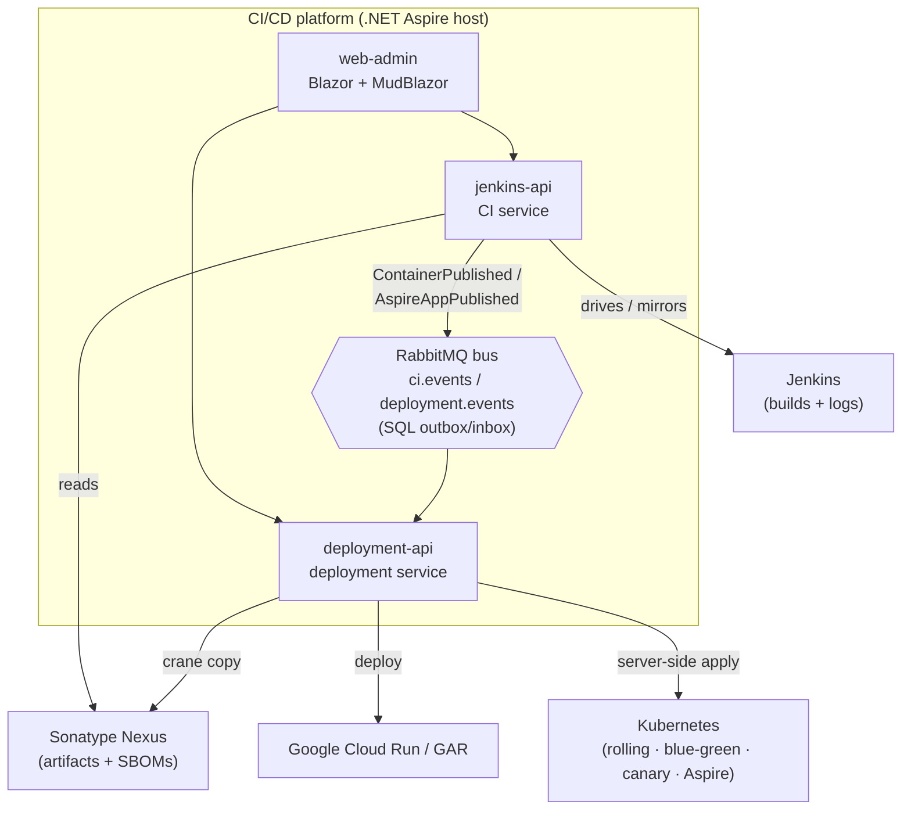
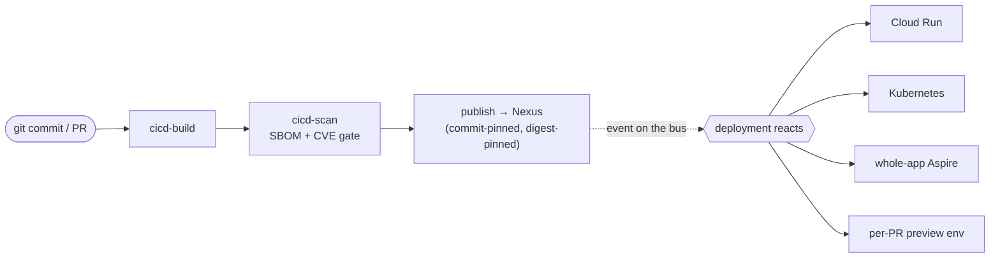
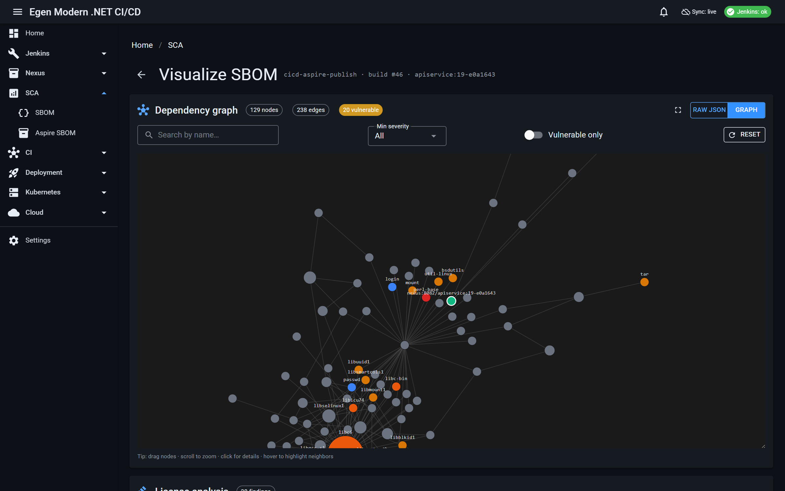
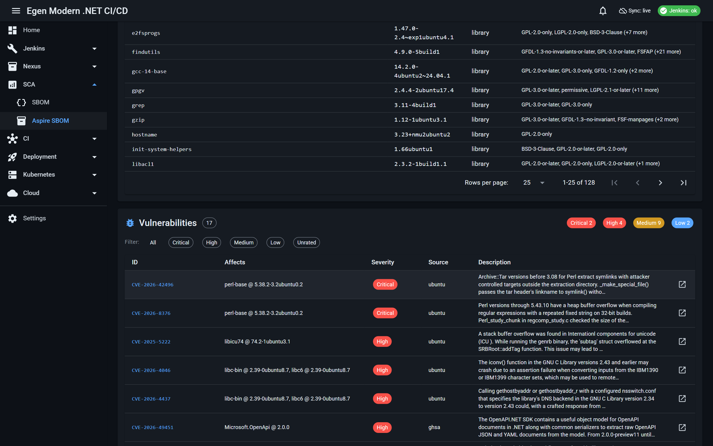

# Ship in minutes, not weeks

A **repo-agnostic CI/CD platform** that replaces the monolith-and-VM pipeline — **adopted without a
big-bang rewrite**. Jenkins builds any Git repo and publishes commit-pinned artifacts to Sonatype
Nexus; an event-driven deployment service promotes them to **Google Cloud Run** or deploys whole
**.NET Aspire** apps to **Kubernetes** — with per-PR preview environments, progressive rollouts, and
one-click rollback. It **builds on the systems you already run** (Jenkins, Nexus, your cluster) rather
than replacing them.

> **→ Just want to run it?** See [docs/getting-started.md](docs/getting-started.md).

## Executive summary

A repo-agnostic CI/CD platform that moves software delivery from **weeks → same-day** while **building
on the systems you already run**. It orchestrates your existing Jenkins builds and Nexus artifacts and
automatically deploys commit-pinned, immutable containers to **Google Cloud Run or Kubernetes** (and
whole .NET Aspire apps) — with per-PR preview environments, progressive rollouts, and one-click
rollback.

- **Business outcome** — moves the four delivery metrics leadership reports on (DORA: lead time,
  deployment frequency, change-failure rate, time-to-restore) in the right direction, while cutting
  always-on infrastructure spend and idle build/packaging time.
- **Low-risk adoption** — strangler-fig: point it at a repo you already have, carve off the first
  service, and expand. No big-bang rewrite, no data migration; value on day one.
- **No lock-in** — multi-cloud, multi-build, multiple application types. Artifacts stay in Nexus,
  builds and logs in Jenkins, runtime in your cluster — it adds a control plane, not another data store.
- **Safe by design** — SBOM + CVE gate before publish, digest-pinned immutable artifacts, approval
  gates, and health-gated rollouts with automatic rollback.

---

## 1. The landscape it solves

Most teams still ship through a **monolithic build packaged into VMs**. That status quo taxes the
three numbers leadership is measured on — **lead time, throughput, and risk**:

| Today's pipeline | What it costs |
| --- | --- |
| Monolithic build, 30+ min | Slow feedback; CI is a bottleneck for every change |
| Packaged into VM images, hours | Heavy, mutable artifacts; hard to trace back to a commit |
| Running on always-on VMs | Idle capacity, manual scaling/recovery, config drift |
| Weeks to build & deploy, big batches | High blast radius, slow time-to-value |
| Manual rollback | Long, error-prone recovery when something breaks |
| One shared staging queue | Reviews serialize; environments collide |
| Tickets & tribal knowledge | No provenance, no audit trail, gatekeeping by people |

The goal isn't a new toolchain for its own sake — it's to move **hours → minutes** and **weeks →
same-day**, while making every release safer and traceable.

<!-- additional points (landscape): add your specifics here -->

---

## 2. Business advantages

**The four delivery numbers, moved in the right direction (DORA):**

| Metric | From → To | How |
| --- | --- | --- |
| **Lead time for changes** | weeks → **same-day** | commit-pinned builds + automated CI→deploy handoff |
| **Deployment frequency** | batched → **on every merge** | event-driven auto-deploy, no manual promotion queue |
| **Change failure rate** | **lower by design** | digest-pinned artifacts, approval gates, SBOM + CVE gate, drift detection |
| **Time to restore** | hours → **minutes** | one-click rollback to the exact prior known-good digest |

**Where the cost comes back** (directional levers, not a quote):

- **Infrastructure** — always-on, over-provisioned VMs → **pay-for-use**, elastic Cloud Run / Kubernetes.
- **Engineering time** — 30-minute builds and hours-long packaging are paid idle time → **minutes**.
- **Time-to-market** — faster lead time isn't just cost saved, it's **value delivered sooner**.
- **Incidents & risk** — immutable artifacts + gates + fast rollback shrink both the odds and the cost
  of a bad release.

> These are **directional templates, not claims**. The consistent pattern is the point: *hours →
> minutes, weeks → same-day, always-on → pay-for-use.* Plug in your own build times, VM spend, and
> release cadence to size it.

**Adoption without a rewrite (strangler-fig).** Point it at a repo you already have → carve off the
first service → turn on auto-deploy and per-PR previews → expand and add gates as confidence grows.
Risk stays low; value starts on day one. And because it **runs on the systems you already own**
(Jenkins for builds, Nexus for artifacts, your cluster for runtime), there's no data migration and no
new store to operate.

<!-- additional points (business): add your specifics here -->

---

## 3. Technical advantages

- **Repo-agnostic CI** — build, scan, and publish *any* Git repo; nothing is hardcoded to one app.
- **Commit-pinned & digest-pinned, immutable artifacts** — every artifact traces to an exact commit;
  re-running never overwrites. Deploys are reproducible by digest.
- **Copy-not-compile images** — slim, non-root runtime images with a healthcheck; build once, promote
  the same bytes.
- **Event-driven & decoupled** — CI publishes *facts* on a bus; the deployment service *reacts*.
  Neither calls the other. Reliability comes from a durable **SQL outbox/inbox** (Wolverine +
  RabbitMQ), so events aren't lost and handlers are idempotent.
- **Shift-left security** — CycloneDX SBOMs + a **CVE gate that fails the build** (`FAIL_ON_SEVERITY`)
  before anything reaches a registry, let alone a cluster.
- **Progressive delivery on vanilla Kubernetes** — blue-green and **ingress-weighted canary** (real
  nginx traffic weighting, not replica approximation) with health gates and auto-rollback — **no
  service mesh or Argo Rollouts required**.
- **Multi-target deploys** — Google Cloud Run (digest-preserving `crane` copy Nexus→GAR + the Cloud
  Run admin API) **and** Kubernetes (in-process client, server-side apply) **and** whole-app Aspire
  (Aspir8).
- **Clean Architecture (.NET 10)** — Api / Application / Domain / Infrastructure, vertical slices,
  first-class OpenTelemetry over OTLP.

**Stack:** .NET 10 · C# 13 · ASP.NET Core · EF Core 10 · Clean Architecture · Wolverine (CQRS + bus +
SQL outbox) · Blazor Server + MudBlazor · **SQL Server** · **RabbitMQ** · .NET Aspire · Jenkins ·
Sonatype Nexus · Trivy · CycloneDX · Aspir8 · crane · Kubernetes · Google Cloud Run / Artifact Registry.

<!-- additional points (technical): add your specifics here -->

---

## 4. Architecture

Three ASP.NET Core services — **`web-admin`** (Blazor UI), **`jenkins-api`** (CI), and
**`deployment-api`** — coupled *only* by integration events on a RabbitMQ bus. Each is a Clean
Architecture service built on **ports & adapters**, with its own SQL Server database
(**database-per-service**). The whole local stack is orchestrated by the **.NET Aspire** AppHost. The
platform *drives* the systems it integrates with — Jenkins, Nexus, Kubernetes, Cloud Run — rather than
reimplementing them.

**The commit-to-running flow** — CI publishes a fact; deployment reacts. Neither service knows about
the other:

### Architectural qualities

- **a) Augments existing on-prem & cloud CI/CD** — wraps Jenkins (CI) and Nexus (artifacts) and adds
  Cloud Run *and* Kubernetes targets. It coexists with what you run rather than ripping it out.
- **b) Pluggable / replaceable elements** — ports & adapters throughout: the build engine
  (`IPipelineOrchestrator`), artifact promotion (`IArtifactPromoter`, crane today), deploy steps
  (`IDeploymentStepExecutor` — GarPush / CloudRunDeploy / KubernetesApply), notifications
  (`INotificationSender` — Slack / email), and the message transport (`CicdMessaging`, RabbitMQ or
  in-memory). Swap an implementation without touching the domain.
- **c) Portable across environments** — runs locally under Aspire (docker-desktop), as containers
  (Dockerfiles / compose), or against the cloud. Targets are config-driven (kubeconfig / context,
  Google ADC) — nothing hardcodes a cloud.
- **d) Extensible** — vertical-slice feature folders; add a deploy step, rollout strategy, integration
  event, deploy target, or pipeline stage additively.
- **e) Integratable** — typed REST + OpenAPI on both services, an event bus other systems can
  subscribe to, git webhooks (PR ingress), SignalR live status, OTLP telemetry, and Slack / SMTP
  outbound. Standard protocols end to end.
- **f) Reliable & resilient** — durable SQL outbox/inbox (no lost events), idempotent handlers,
  digest-pinned reproducible deploys; health-gated rollouts with auto-rollback; self-healing
  Kubernetes / Cloud Run targets.
- **g) Observable & operable** — first-class OpenTelemetry (OTLP traces + metrics), the Aspire
  dashboard, live SignalR run status, and a DORA delivery dashboard.
- **h) Secure & auditable** — SBOM provenance + CVE gate, non-root images, secrets kept out of git;
  every artifact traces to a commit, with persisted deploy and pipeline-run history.
- **i) Cloud-neutral, scalable, testable, modular** — standard formats (OCI images, CycloneDX SBOMs,
  Kustomize); stateless, queue-buffered services that scale out; ports-and-adapters + an in-memory bus
  make the domain unit-testable; database-per-service bounded contexts evolve independently.
- **j) Multi-cloud & multi-build** — cloud-neutral targets (Cloud Run today; Kubernetes on any cloud
  or on-prem) and a **pluggable build engine** (Jenkins via `IPipelineOrchestrator`), repo-agnostic
  across build systems.
- **k) Built on your systems of record — no custom stores** — **artifacts live in Nexus, build
  execution and logs in Jenkins, runtime state in the cluster.** The platform keeps only *lightweight
  coordination state* — configuration, run history, and provenance references — and reads or mirrors
  the sources of truth rather than duplicating them (`NexusImageDigestResolver` reads Nexus,
  `JenkinsBuildSyncService` mirrors build metadata, `KubeClusterReader` reads the live cluster). *(It
  keeps two small SQL databases for its own config, run history, and the build mirror — it is a thin
  control plane, not a replacement data store for your artifacts or logs.)*
- **l) Multiple build & application types** — per-service containers (Cloud Run / Kubernetes),
  whole-app **Aspire → Kubernetes** (Aspir8), and NuGet packages; repo- and app-type-agnostic.

<!-- additional points (architecture): add your specifics here -->

---

## 5. Features that make it possible

Each capability maps to an advantage above:

| Capability | Enables |
| --- | --- |
| Repo-agnostic, commit-pinned build/scan/publish; copy-not-compile images; **SBOM + CVE gate** | Lower change-failure rate + supply-chain compliance |
| Deploy strategies — rolling, **blue-green**, **ingress-weighted canary**, approval gates, **one-click rollback**, cross-environment promotion | Safe releases + fast restore |
| **Preview environment per PR** (ephemeral namespace, browsable URL, teardown on close) | Lead time + review quality |
| **Event-driven auto-deploy** (CI publishes → deployment reacts) | Same-day, on-every-merge delivery |
| **Multi-cloud · multi-build · multi-app-type** (Cloud Run + Kubernetes + whole-app Aspire; Jenkins-driven, pluggable; containers, Aspire apps, NuGet) | Portability + no lock-in |
| **Built on your systems of record** (Nexus artifacts, Jenkins builds + logs, live cluster state — no custom stores) | Augments existing on-prem & cloud tooling |
| **DORA dashboard** (deployment frequency, lead time, change-failure rate), OTLP metrics/traces, live SignalR status | Measurability |
| Kubernetes admin screens, Slack / email notifications, data reset + demo seeder | Day-to-day operability |

See the full, PR-referenced catalog in **[docs/features.md](docs/features.md)**.

<!-- additional points (features): add your specifics here -->

---

## Learn more

| Doc | What |
| --- | --- |
| [docs/platform-pitch.md](docs/platform-pitch.md) | The leadership pitch deck — problem, DORA, ROI, adoption |
| [docs/architecture.md](docs/architecture.md) | Full architecture, components, and diagrams |
| [docs/features.md](docs/features.md) | Complete feature catalog, by area, with PR references |
| [docs/getting-started.md](docs/getting-started.md) | Run it locally — setup, secrets, layout, commands |

---

## Screenshots

> Captured from a running instance ([`docs/screenshots/`](docs/screenshots/)) — chosen to show a
> business outcome, not just a UI.

### Single pane of glass — the Overview dashboard

*Deploys/day, success rate, and change-failure at a glance — plus deploy health and a live activity
feed, updated over SignalR.*

### Delivery metrics (DORA)

*The delivery numbers leadership reports on — success rate, change-failure rate, deployment frequency,
average duration — computed from real run history and also exported over OpenTelemetry.*

### Real CI — a pipeline run with a live console

*Orchestrated Jenkins jobs — build → scan → publish, each commit-pinned — with the live, persisted
stage console.*

### Safe releases — namespace-isolated blue-green

*A whole app rolled out into a parallel `blue` slot namespace, health-gated before cutover — promote
or roll back with one click. Blue-green and ingress-weighted canary run on vanilla Kubernetes.*

### A preview environment per PR

*Every pull request gets an ephemeral, browsable environment in its own namespace — auto-expiring on a
TTL and torn down on close.*

### Multi-target deploys — Kubernetes and Cloud Run

*Service→environment mappings with typed steps (`KubernetesApply`, `GarPush → CloudRunDeploy`) and
per-mapping auto-deploy — one model across clouds and clusters.*

### Whole-app Aspire deploy — digest-pinned & traceable

*A whole .NET Aspire app deployed to Kubernetes — every workload pinned to a digest-tagged image
promoted from Nexus, with the manifest source and full deploy log. Every deploy traces to a commit.*

### SBOM visualizer — the dependency graph

*Every image gets a per-CycloneDX SBOM from the `cicd-aspire-publish` Trivy scan, rendered as an
interactive dependency graph — here 129 components and 238 edges, with the 20 vulnerable nodes flagged.*

### Vulnerabilities — CVEs by severity

*The same scan's CVE inventory — severity-ranked (2 critical · 4 high · 9 medium · 2 low), each with
the affected package, source advisory, and a link out. This is exactly what the build's
`FAIL_ON_SEVERITY` gate acts on before anything publishes.*
