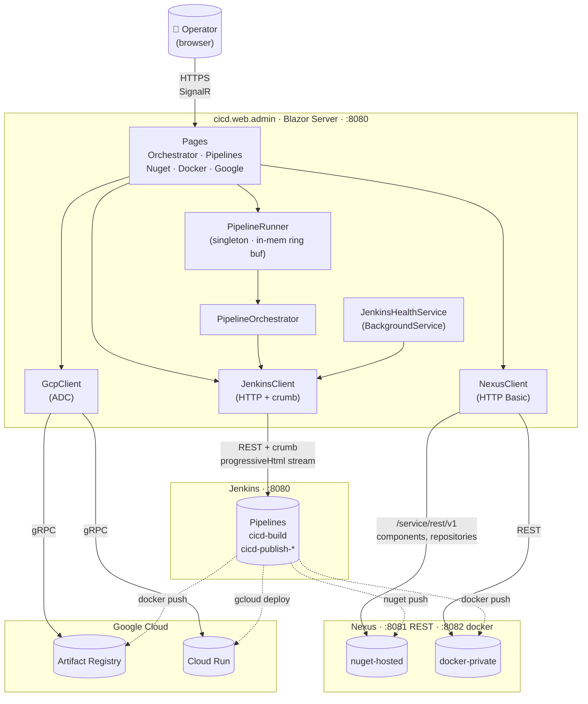
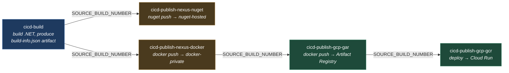

# Architecture

Runtime architecture and CI/CD operations flow for the cicd workspace. Diagrams use [Mermaid](https://mermaid.js.org/) — they render inline in VSCode (Markdown Preview) and on GitHub.

## Runtime architecture

### Notes

- **Single-direction trust**: the WebUI initiates everything. Jenkins / Nexus / GCP never call back into the WebUI — state is pulled (poll / stream), not pushed.
- **In-memory orchestration**: `PipelineRunner` is a singleton — it survives page navigations but not WebUI restarts. Console logs live in a ~1 MB ring buffer per step.
- **Two Nexus ports**: REST API on `:8081`, Docker registry connector on `:8082`. Same hostname, different listeners. The WebUI only talks to the REST port; the Docker connector is used by Jenkins' `docker push`.
- **Credentials**: the WebUI reads Jenkins / Nexus credentials from environment variables (`Jenkins__ApiToken`, `Nexus__Password`); GCP uses Application Default Credentials. Nothing secret lives in `appsettings.json`.

## Operations — CI/CD pipeline chain

### Artifact forwarding

`cicd-build` archives `build-info.json` (package version, info version, git commit, build number). Every downstream step pulls that artifact from the upstream build using the Jenkins Copy Artifact plugin's `SpecificBuildSelector` (with `SOURCE_BUILD_NUMBER`) or `StatusBuildSelector` (last successful). The orchestrator's only job is to supply the right `SOURCE_BUILD_NUMBER` to each downstream invocation — the build-info JSON itself carries everything else.

### Parallelism

The chain is logically a DAG (the two `nexus-*` publishes share `cicd-build` as their input), but the orchestrator runs steps sequentially in declaration order. Parallel execution would need orchestrator changes — currently a single failed step stops the chain.

## Where things live

| Concern | Project |
| --- | --- |
| Blazor UI, pages, layout | `src/web-admin/cicd.web.admin` |
| Jenkins HTTP client | `src/jenkins/Jenkins.Client` |
| Pipeline orchestration | `src/jenkins/Jenkins.Orchestrator` (+ `.Abstractions`) |
| Jenkinsfiles | `jenkins/build/`, `jenkins/publish/nexus/{nuget,docker}/`, `jenkins/publish/gcp/{gar,gcr}/` |
| Pipeline definition (which job feeds which) | `Jenkins.Orchestrator/DefaultPipelines.cs` |
